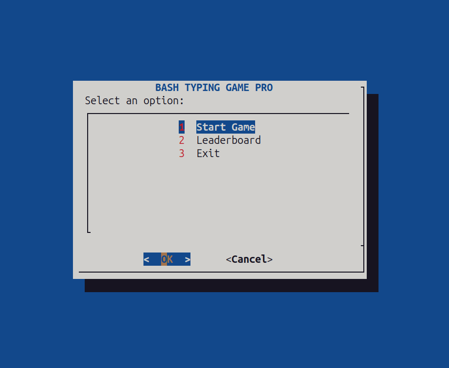

# Typing Game

### 1. Introduction
**Typing Game** is an interactive game designed to help users improve their typing speed and accuracy. It provides real-time feedback, scoring, and a fun challenge for players of all levels.

---

### 2. Project Description
This project is written in **Bash** and designed to run in a Linux terminal (Ubuntu was used for development).  
It uses standard Bash commands and utilities to display words, track time, and calculate scores.


---

### 3. Features
- Terminal-based gameplay (no GUI required) 
- Real-time typing tracking  
- Timer and scoring system  
- Random word generation  
- Clean and simple interface  
- Responsive design for different screen sizes  

---

### 4. Gameplay preview


---

### 5. Requirements
To run the game:  
- A Linux system with Bash installed (Ubuntu, Debian, Fedora, etc.) 

**Playing on other OS:**
- **Windows:** You can run it using [Windows Subsystem for Linux (WSL)](https://learn.microsoft.com/en-us/windows/wsl/install) or Git Bash.  
- **macOS:** The game can run directly in the terminal.  

No additional libraries are needed.

---

### 6. How to Play
1. Open the terminal and navigate to the game folder.  
   ```cd path-to-typing_game```
2. Make the script executable (if not already):
   ```chmod +x typing_game.sh```
3. Run the game:
   ```./typing_game.sh```
4. Words will appear on the screen.  
5. Type the words as fast and accurately as possible.   
6. Your score increases with every correct word.  
7. Try to beat your own high score!  

---

### 7. How to Contribute
Contributions are welcome! To contribute:  
1. Fork the repository.  
2. Create a new branch for your feature:  
   ```git checkout -b feature-name```
3. Make your changes and commit:
   ```git commit -m "Add feature or fix issue"```
4. Push to your branch:
   ```git push origin feature-name```
5. Submit a pull request.

### 8. License
This project is open source under the MIT License. You are free to use, modify, and distribute it.
